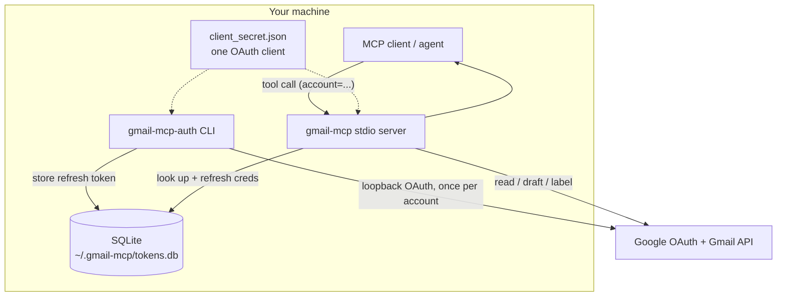

# gmail-mcp


**An [MCP](https://modelcontextprotocol.io) server that reads across _all_ your
Gmail accounts from one connection.**

Most Gmail integrations — including the native connectors — bind a single
account per OAuth grant: connect a second inbox and you disconnect the first.
`gmail-mcp` keeps any number of accounts authorized at once. One Google Cloud
client authorizes them all, each lands as a row in a local SQLite file, and every
tool takes an `account` argument that routes to the right mailbox.
`search_all_accounts` sweeps all of them in a single query.

> Python 3.12+ · MIT · stdio MCP server + auth CLI · local SQLite token store

It's built to be **owned completely**: runs in-process over stdio, stores tokens
in one SQLite file you can inspect, copy, or delete, talks only to Google and
your MCP client, and hardcodes no secrets.

It reads, searches, drafts, and labels. It doesn't send — `create_draft` leaves
a draft for you to send yourself. That's a deliberate default (more on the
reasoning in [Security notes](#security-notes)), not a hard stance; if you want
autonomous send, it's a small addition or a different server.

---

## Contents

- [The idea in 30 seconds](#the-idea-in-30-seconds)
- [Design notes](#design-notes)
- [Tools](#tools)
- [Architecture](#architecture)
- [Install](#install)
- [Quickstart](#quickstart)
- [Configuration](#configuration)
- [Register with an MCP client](#register-with-an-mcp-client)
- [Security notes](#security-notes)
- [Development](#development)
- [Project layout](#project-layout)
- [License](#license)

---

## The idea in 30 seconds

Authorize N accounts once via the CLI. Then every tool takes an `account`, and
`search_all_accounts` hits all of them at once:

```
search_all_accounts(query="invoice newer_than:30d")

  ── personal@gmail.com ───────────────────────────────
  from: billing@acme.com    subject: Invoice #4821    (id 18f...)

  ── work@company.com ─────────────────────────────────
  from: ap@vendor.io        subject: March invoice     (id 19a...)
```

One query, every inbox, each result tagged with its account and carrying the
message id — so the agent can chain `read_message(account, id)` or
`create_draft(...)` next.

---

## Design notes

**One OAuth client, many inboxes.** A single Google Cloud project and one
`client_secret.json` authorize every account. Adding the tenth inbox is the same
one-command flow as the first.

**Boring storage.** Tokens live in one SQLite file under `~/.gmail-mcp/`. No
daemon, no keyring dependency, no cloud. Back it up by copying it; revoke an
account by deleting a row; inspect it with any SQLite tool.

**Least privilege.** Three granular scopes — `gmail.readonly`, `gmail.compose`,
`gmail.modify` — never the full-mailbox `https://mail.google.com/`. It can read,
draft, and label; it can't delete mail.

**Headless-friendly.** The auth flow assumes the server may have no browser: it
prints a consent URL, binds a fixed port, and you SSH-forward the redirect. Works
fine on a desktop too.

---

## Tools

Every tool except `list_accounts` and `search_all_accounts` takes an `account`
(the email address). Unknown accounts return an error listing the authorized ones.

| Tool | Arguments | Returns |
| --- | --- | --- |
| `list_accounts` | — | Authorized accounts + last-used time. Discover valid `account` values. |
| `search_messages` | `account`, `query`, `max_results=20` | Message summaries (Gmail search syntax) with ids. |
| `read_message` | `account`, `message_id`, `format="full"` | Decoded headers, plaintext body (HTML stripped if needed), attachment metadata. |
| `read_thread` | `account`, `thread_id` | Every message in the thread, in order. |
| `search_all_accounts` | `query`, `max_results_per_account=10` | One search across **every** account, each result tagged by account. |
| `create_draft` | `account`, `to`, `subject`, `body`, `cc?`, `bcc?`, `html=false` | A draft (not sent). Returns the draft id. |
| `list_drafts` | `account`, `max_results=20` | Draft ids in the account. |
| `list_labels` | `account` | The account's labels (name + id). |
| `modify_labels` | `account`, `message_id`, `add?`, `remove?` | Add/remove labels by id **or** name (resolves existing labels; won't create). |

---

## Architecture



Authorization happens once per account through the CLI (it needs a browser).
After that the stdio server reads tokens straight from SQLite, refreshing access
tokens on demand and persisting them back. Full token lifecycle and diagrams in
**[docs/AUTH.md](docs/AUTH.md)**.

---

## Install

Requires Python 3.12+.

```bash
git clone https://github.com/cunicopia-dev/gmail-mcp.git
cd gmail-mcp
python -m venv .venv && source .venv/bin/activate
pip install -e .            # add ".[dev]" for ruff + pytest
```

This installs two console scripts: **`gmail-mcp`** (the stdio server) and
**`gmail-mcp-auth`** (the account-authorization CLI).

---

## Quickstart

You need a Google "Desktop app" OAuth client (`client_secret.json`) and one
authorization per account. The full click-by-click — creating the Google Cloud
project, enabling the Gmail API, publishing the consent screen, and the headless
SSH-forward step — is in **[docs/SETUP.md](docs/SETUP.md)**. The short version:

```bash
# 1. Drop your downloaded OAuth client here:
mkdir -p ~/.gmail-mcp && mv ~/Downloads/client_secret_*.json ~/.gmail-mcp/client_secret.json

# 2. Authorize an account (prints a URL to open in a browser; repeat per account).
#    On a headless server, SSH in with -L 8765:localhost:8765 first.
gmail-mcp-auth add

# 3. Confirm what's authorized.
gmail-mcp-auth list

# 4. Point your MCP client at the `gmail-mcp` command (see below).
```

Remove an account later with `gmail-mcp-auth remove you@gmail.com`.

---

## Configuration

All optional — sane defaults under `~/.gmail-mcp/`.

| Variable | Default | Purpose |
| --- | --- | --- |
| `GMAIL_MCP_DB` | `~/.gmail-mcp/tokens.db` | SQLite token store path. |
| `GMAIL_MCP_CLIENT_SECRET` | `~/.gmail-mcp/client_secret.json` | Downloaded Google OAuth client. |
| `GMAIL_MCP_OAUTH_PORT` | `8765` | Fixed loopback port for the auth flow (forward this over SSH on a headless box). |

---

## Register with an MCP client

The server speaks stdio. Point your client's `mcpServers` config at the
`gmail-mcp` command:

```json
{
  "mcpServers": {
    "gmail": {
      "command": "/path/to/gmail-mcp/.venv/bin/gmail-mcp"
    }
  }
}
```

If `gmail-mcp` is on `PATH`, `"command": "gmail-mcp"` is enough. Override paths
explicitly when needed (some clients don't expand `~`):

```json
{
  "mcpServers": {
    "gmail": {
      "command": "/path/to/gmail-mcp/.venv/bin/gmail-mcp",
      "env": {
        "GMAIL_MCP_DB": "/home/you/.gmail-mcp/tokens.db",
        "GMAIL_MCP_CLIENT_SECRET": "/home/you/.gmail-mcp/client_secret.json"
      }
    }
  }
}
```

---

## Security notes

An inbox is full of text other people wrote, so it's a natural place for prompt
injection — an email that tries to talk your agent into doing something. A couple
of choices keep that low-stakes:

- **Drafts instead of send.** `create_draft` is the outgoing ceiling; there's no
  send tool and no `gmail.send` scope. A draft just sits in your drafts folder
  until you send it, so an instruction buried in some email can't make the agent
  mail your data anywhere. It's a sensible default, easy to change if you want
  send — not a guarantee about anything beyond this server's own surface.
- **Email content is marked as untrusted.** Message text the tools return is
  wrapped in `⟦UNTRUSTED EMAIL CONTENT⟧` delimiters, with ids kept outside so
  tool-chaining still works. The read tools also note in their descriptions that
  content is data, not instructions.

Worth knowing: this only governs *this* server. If the same agent session also
has a tool that can reach the open internet (web fetch, HTTP), that's a separate
egress path `gmail-mcp` can't do anything about. The reasoning and full threat
model are in **[docs/AUTH.md](docs/AUTH.md)**.

---

## Development

```bash
pip install -e ".[dev]"
ruff check .
pytest                       # 48 tests, no network — the Gmail client is mocked
```

Tests cover the pure layers — MIME parsing/decoding, label name→id resolution,
the untrusted-content wrapper, output formatting, and token-store CRUD against a
temp SQLite db.

---

## Project layout

```
src/gmail_mcp/
  server.py    MCP tool definitions + dispatch + per-account routing
  gmail.py     Gmail service build, token refresh/persist, MIME parse/format,
               wrap_untrusted(), label resolution, MIME message build
  store.py     TokenStore — sqlite3 accounts table CRUD
  auth.py      gmail-mcp-auth CLI: add / list / remove (loopback OAuth)
  config.py    SCOPES + env-overridable paths
docs/
  AUTH.md      identity & auth model, token lifecycle, threat model (+ diagrams)
  SETUP.md     step-by-step Google Cloud + account authorization
tests/         store / gmail / server, Gmail client mocked
```

---

## License

MIT — see [LICENSE](LICENSE).
