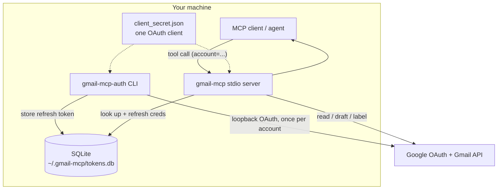
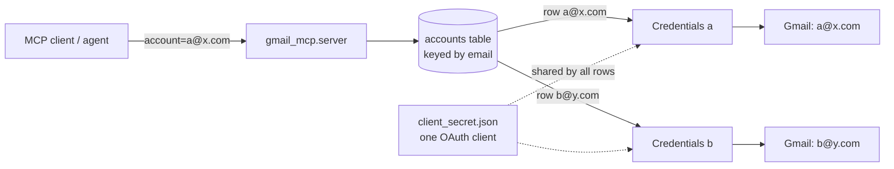
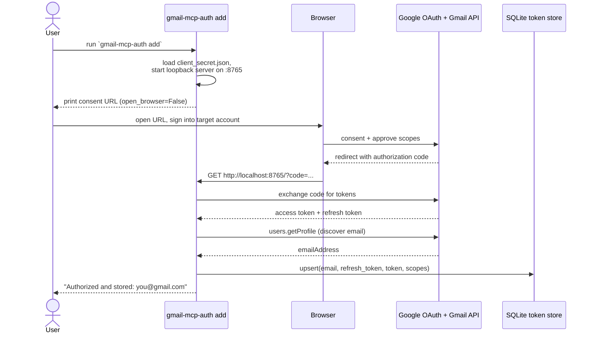
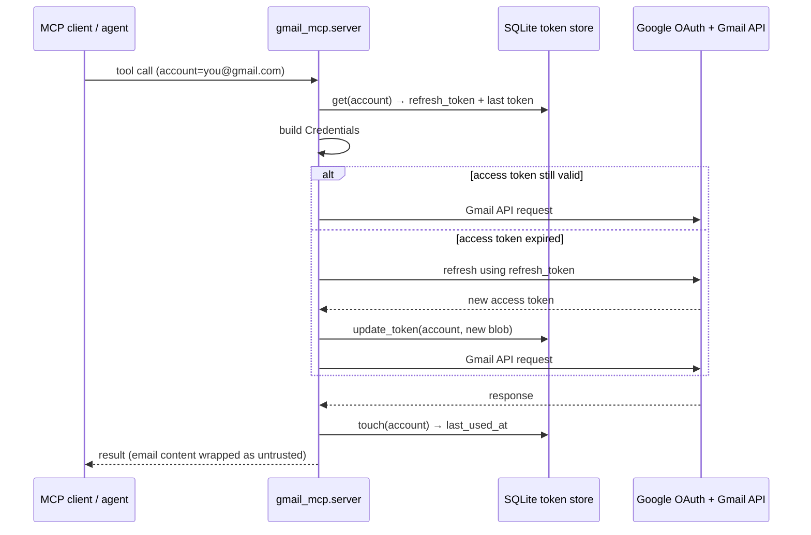
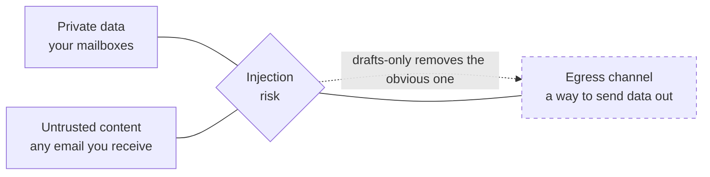

# gmail-mcp

<!-- mcp-name: io.github.cunicopia-dev/multi-account-gmail-mcp -->


**An [MCP](https://modelcontextprotocol.io) server that reads across _all_ your
Gmail accounts from one connection.**

Most Gmail integrations — including the native connectors — bind a single
account per OAuth grant: connect a second inbox and you disconnect the first.
`gmail-mcp` keeps any number of accounts authorized at once. One Google Cloud
client authorizes them all, each lands as a row in a local SQLite file, and every
tool takes an `account` argument that routes to the right mailbox.
`search_all_accounts` sweeps all of them in a single query.

> Python 3.12+ · MIT · stdio MCP server + auth CLI · local SQLite token store

It's built to be **owned completely**: runs in-process over stdio, stores tokens
in one SQLite file you can inspect, copy, or delete, talks only to Google and
your MCP client, and hardcodes no secrets.

It reads, searches, drafts, and labels. It doesn't send — `create_draft` leaves
a draft for you to send yourself. That's a deliberate default (reasoning in
[Security model](#security-model)), not a hard stance; if you want autonomous
send, it's a small addition or a different server.

---

## Contents

- [The idea in 30 seconds](#the-idea-in-30-seconds)
- [Design notes](#design-notes)
- [Tools](#tools)
- [Architecture](#architecture)
- [Identity & auth model](#identity--auth-model)
  - [The OAuth model](#the-oauth-model)
  - [The multi-account model](#the-multi-account-model)
  - [Token lifecycle](#token-lifecycle)
  - [The headless auth path](#the-headless-auth-path)
- [Security model](#security-model)
- [Install](#install)
- [Quickstart](#quickstart)
- [Configuration](#configuration)
- [Register with an MCP client](#register-with-an-mcp-client)
- [Development](#development)
- [Project layout](#project-layout)
- [License](#license)

---

## The idea in 30 seconds

Authorize N accounts once via the CLI. Then every tool takes an `account`, and
`search_all_accounts` hits all of them at once:

```
search_all_accounts(query="invoice newer_than:30d")

  ── personal@gmail.com ───────────────────────────────
  from: billing@acme.com    subject: Invoice #4821    (id 18f...)

  ── work@company.com ─────────────────────────────────
  from: ap@vendor.io        subject: March invoice     (id 19a...)
```

One query, every inbox, each result tagged with its account and carrying the
message id — so the agent can chain `read_message(account, id)` or
`create_draft(...)` next.

---

## Design notes

**One OAuth client, many inboxes.** A single Google Cloud project and one
`client_secret.json` authorize every account. Adding the tenth inbox is the same
one-command flow as the first.

**Boring storage.** Tokens live in one SQLite file under `~/.gmail-mcp/`. No
daemon, no keyring dependency, no cloud. Back it up by copying it; revoke an
account by deleting a row; inspect it with any SQLite tool.

**Least privilege.** Four granular scopes — `gmail.readonly`, `gmail.compose`,
`gmail.modify`, `gmail.settings.basic` — never the full-mailbox
`https://mail.google.com/`. It can read, draft, label, and manage filters; it
never sends mail, and filters it creates can't forward mail off-account.

**Headless-friendly.** The auth flow assumes the server may have no browser: it
prints a consent URL, binds a fixed port, and you SSH-forward the redirect. Works
fine on a desktop too.

---

## Tools

Every tool except `list_accounts` and `search_all_accounts` takes an `account`
(the email address). Unknown accounts return an error listing the authorized ones.

| Tool | Arguments | Returns |
| --- | --- | --- |
| `list_accounts` | — | Authorized accounts + last-used time. Discover valid `account` values. |
| `search_messages` | `account`, `query`, `max_results=20` | Message summaries (Gmail search syntax) with ids. |
| `read_message` | `account`, `message_id`, `format="full"`, `max_body_chars?` | Decoded headers, plaintext body (HTML stripped if needed), attachment metadata. Body capped by default; pass `max_body_chars=0` for the full body. |
| `read_thread` | `account`, `thread_id`, `max_body_chars?` | Every message in the thread, in order. Each body capped by default; `max_body_chars=0` for full. |
| `download_attachments` | `account`, `message_id`, `index?` | Save a message's attachments to disk and return absolute paths. Address them by the `#N` shown in `read_message`; omit `index` for all of them. Fixed download root, no destination argument. Dangerous file types and anything on a spam-labeled message are refused. |
| `search_all_accounts` | `query`, `max_results_per_account=10` | One search across **every** account, each result tagged by account. |
| `create_draft` | `account`, `body`, `to?`, `subject?`, `cc?`, `bcc?`, `html=false`, `reply_to_message_id?`, `reply_all=false`, `from_addr?` | A draft (not sent). Returns the draft id. With `reply_to_message_id` the draft is a reply inside that message's thread: recipient, subject, `In-Reply-To`, `References` and the thread id come from it, and `to`/`subject` become optional overrides. Without it, `to` and `subject` are required. `from_addr` sets the `From` header for a verified send-as alias; it defaults to the account address. |
| `list_drafts` | `account`, `max_results=20` | Draft ids in the account. |
| `list_labels` | `account` | The account's labels (name + id). |
| `modify_labels` | `account`, selection (`message_id` \| `message_ids` \| `query`), `add?`, `remove?` | Add/remove labels on a **selection** (one id, a list, or everything a query matches), batched 1000/call. General mutator: archive = remove INBOX, mark-read = remove UNREAD, star = add STARRED. |
| `trash` | `account`, selection (`message_id` \| `message_ids` \| `query`) | Move a selection to Trash (recoverable 30 days; not permanent delete). Refuses an empty selection. |
| `bulk_action` | `account`, `action`, selection (`message_id` \| `message_ids` \| `query`) | Friendly verb layer over `modify_labels`. `action` ∈ `archive`/`unarchive`/`mark_read`/`mark_unread`/`star`/`unstar`/`spam`/`unspam`/`trash`/`untrash`. Batched 1000/call; refuses an empty selection. |
| `read_messages` | `account`, `message_ids` \| `query`, `max_results=25` | Batch-read full content of many messages in one call (vs. N `read_message` calls). |
| `count_messages` | `query`, `account?`, `all_accounts=false` | Count matches **without** fetching content — blast-radius check before a bulk action. `all_accounts` gives a per-account breakdown + total. |
| `list_filters` | `account` | The account's filters: id, criteria, actions (label ids shown as names). |
| `create_filter` | `account`, one of `from_address`/`to_address`/`subject`/`query`/`has_attachment`, plus an action (`archive`/`mark_read`/`delete`/`star` or `add_labels`/`remove_labels`) | A server-side rule applied to **incoming** mail. Can't forward off-account. |
| `delete_filter` | `account`, `filter_id` | Remove a filter by id (leaves already-acted-on mail alone). |

---

## Architecture



Authorization happens once per account through the CLI (it needs a browser).
After that the stdio server reads tokens straight from SQLite, refreshing access
tokens on demand and persisting them back. The rest of this section is the
"why it works the way it does" detail.

---

## Identity & auth model

How `gmail-mcp` authenticates to Gmail, juggles multiple accounts under a single
OAuth client, refreshes tokens over time, and authorizes accounts on a headless
server. If you just want to get running, jump to [Quickstart](#quickstart).

### The OAuth model

`gmail-mcp` authenticates using a Google **"Desktop app"** OAuth client (an
*installed application* in OAuth 2.0 terms), driven by the `InstalledAppFlow`
helper from `google-auth-oauthlib`.

**Why an installed-app / desktop client.** Installed apps run on a machine the
end user controls, so OAuth treats them as **public clients**: the `client_secret`
in the downloaded `client_secret.json` is *not* assumed to be confidential.
That's the right trust model for a local CLI/desktop tool — there's no
server-side component that could keep a secret truly secret, and security rests
on the user controlling the redirect (the loopback address) rather than on secret
confidentiality. It's the client type Google recommends for command-line and
desktop tools.

**The loopback redirect flow.** After you approve consent in a browser, Google
redirects the authorization code to `http://localhost:<port>/`, where a tiny
throwaway HTTP server (started by `InstalledAppFlow.run_local_server`) catches
it. `gmail-mcp` pins this to a fixed port (default `8765`, override with
`GMAIL_MCP_OAUTH_PORT`) and runs with `open_browser=False` so it works on
machines with no browser — see [The headless auth path](#the-headless-auth-path).

**Scopes requested.** Four granular scopes — never the full-mailbox
`https://mail.google.com/`:

| Scope | What it grants |
|-------|----------------|
| `gmail.readonly` | Read mail and metadata: search messages/threads, read bodies, list labels and drafts. Read-only — cannot modify anything. |
| `gmail.compose` | Create, update, and manage drafts. Used only by `create_draft`. |
| `gmail.modify` | Add/remove labels on messages. Used by `modify_labels`. |
| `gmail.settings.basic` | List, create, and delete filters. Used by `list_filters`/`create_filter`/`delete_filter`. Does **not** grant forwarding-address changes (that's `gmail.settings.sharing`, not requested). |

`gmail.send` is not requested. Without it the credential simply has no Gmail API
path to send mail — the drafts-only behavior is a property of the grant, not just
an omitted tool. `gmail.settings.sharing` is likewise not requested, so no filter
can forward mail to another address. The scope list lives in one place: `SCOPES`
in `src/gmail_mcp/config.py`.

> **Adding the filter scope to an existing install:** widening `SCOPES` does not
> retro-grant already-authorized accounts. Each account must re-run
> `gmail-mcp-auth add` to re-consent to the new scope; until it does, the filter
> tools return a `403 insufficient scope` error.

### The multi-account model

- **One OAuth client authorizes many accounts.** You create a single Google
  Cloud project and one "Desktop app" OAuth client, then run the consent flow
  once per Gmail account, signing into the account you want to add each time. A
  single `client_secret.json` can authorize any number of accounts.
- **Each account is a row in SQLite.** Every authorized account is stored in the
  `accounts` table (`~/.gmail-mcp/tokens.db`, override with `GMAIL_MCP_DB`),
  **keyed by email**. The row holds the long-lived refresh token, the most recent
  access-token blob, the granted scopes, and timestamps.
- **Tool calls route by the `account` param.** Every tool except `list_accounts`
  and `search_all_accounts` takes an `account`. The server looks that email up,
  builds a credential for it, and calls the Gmail API as that account. Unknown
  accounts return a clear error listing what's authorized. `search_all_accounts`
  iterates over every stored row.



### Token lifecycle

**Initial grant** (one-time, per account, via the CLI). The OAuth flow needs a
browser, which an MCP tool can't drive cleanly, so authorization lives in the
`gmail-mcp-auth` CLI rather than as a tool.



- The CLI passes `prompt="consent"` to **force a refresh token to be issued** —
  Google only returns one on a fresh consent. The CLI errors clearly if no
  refresh token comes back (revoke the app at
  <https://myaccount.google.com/permissions> and re-run).
- The account's email is **discovered**, not typed: after the token exchange the
  CLI calls `users.getProfile` and keys the stored row by the returned address.

**Per-request refresh** (every tool call). Access tokens are short-lived (≈1
hour). On each call the server rebuilds a credential for the target account, lets
`google-auth` refresh it on demand, and persists the refreshed blob back.



If a refresh fails (revoked grant, expired refresh token), the server raises
`GmailAuthError` with a "re-run `gmail-mcp-auth add`" message rather than crashing.

**Testing vs. Published — the 7-day gotcha.** This is the usual "it stopped
working after a week" surprise:

- While the OAuth consent screen is in **Testing** mode, only listed **test
  users** can authorize, and refresh tokens issued to an **unverified** app
  **expire after 7 days** — you'd re-run `gmail-mcp-auth add` weekly.
- **Publishing** the app (consent screen → *Publish app*) makes refresh tokens
  long-lived. Google will warn it's "unverified" — expected and fine for a
  self-hosted personal tool you don't distribute. For long-lived use, publish.
  [SETUP.md](docs/SETUP.md) has the exact clicks.

### The headless auth path

The typical target is a headless server (no desktop, no browser), but OAuth
consent has to happen in a browser. The flow bridges that:

- **`open_browser=False`** — the CLI prints the consent URL instead of launching
  a browser. You open it on your own laptop, signed into the account you're
  adding.
- **Fixed loopback port** — after approval Google redirects to
  `http://localhost:<port>/`. That "localhost" is the *server's* loopback, where
  the CLI listens. The port is fixed (default `8765`, `GMAIL_MCP_OAUTH_PORT`) so
  you can forward it deterministically.
- **SSH port-forward** — bridge your laptop's browser to the server's loopback:

  ```bash
  ssh -L 8765:localhost:8765 you@your-server
  ```

  Now when the redirect hits `localhost:8765` on your laptop, SSH tunnels it to
  the server, where the CLI catches the code and finishes the exchange.

---

## Security model

An inbox is full of text other people wrote, so it's a natural place for prompt
injection. The standard framing is the **lethal trifecta** — injection is
dangerous when an agent has all three of:



A mail reader has the first two by nature. A couple of choices keep the third
low-stakes:

- **Drafts instead of send.** `create_draft` is the outgoing ceiling — there's no
  send tool and no `gmail.send` scope. A draft sits in your drafts folder until
  *you* send it, so an instruction buried in an email can't make the agent mail
  your data anywhere. Sensible default, easy to change if you want send.
- **Email content is marked as untrusted.** Message text the tools return is
  wrapped in `⟦UNTRUSTED EMAIL CONTENT⟧` delimiters by a single helper
  (`wrap_untrusted` in `gmail.py`), with ids kept **outside** so tool-chaining
  still works. The read tools also note in their descriptions that content is
  data, not instructions. Multi-message responses (search results, threads,
  cross-account sweeps) emit the fence **once** around the whole content blob —
  not once per message — and key each body to a trusted `#N` id manifest that
  sits outside the fence. This both cuts delimiter token overhead and keeps real
  ids exclusively in the trusted region, so an attacker can't smuggle a forged
  id into a place the agent treats as authoritative.

- **Attachments land in one fixed place, and some never land at all.**
  `download_attachments` writes only under `~/.gmail-mcp/attachments/<message_id>/`
  (`GMAIL_MCP_ATTACHMENT_DIR`). There is deliberately no destination argument,
  because one would be an arbitrary-file-write primitive that an instruction
  buried in an email could aim at `~/.zshrc`. Filenames are attacker-chosen, so
  they are reduced to inert ASCII basenames (path separators dropped, leading
  dots stripped, bidi overrides removed, length capped, index-prefixed), and the
  resolved path is re-checked against the root before the write. Files are
  written owner-only, with `O_NOFOLLOW` so a pre-planted symlink can't redirect
  them.

  Screening happens before any bytes are fetched. It refuses every file type
  [Gmail itself blocks in transit](https://support.google.com/mail/answer/6590)
  (`.exe`, `.jar`, `.js`, `.vbs`, `.iso`, `.py`, ~50 more), macro-enabled Office
  documents, executable MIME types, and every attachment on a message Gmail
  labeled `SPAM`. All of a filename's dot-suffixes are checked, not just the
  last, so `invoice.pdf.exe` is caught. Archives are saved but flagged, since
  nothing here can look inside one.

  **This is a type screen, not a virus scan.** Gmail scans attachments
  server-side but does not expose the verdict through its API. There is no
  malware field on the message or attachment resource, and `attachments.get`
  will serve bytes the Gmail web UI refuses to let you download. A clean verdict
  here means "not an obvious weapon," never "scanned and safe." The saved file's
  *contents* remain untrusted third-party data.

**Known limitation.** This only governs *this* server's surface. If the same
agent session also has a tool that can reach the open internet (web fetch, HTTP),
that's a separate egress path `gmail-mcp` can't do anything about — pairing it
with an arbitrary-egress tool re-opens the trifecta elsewhere. Be deliberate
about which tools share a session.

Two more notes: no audit log is implemented (intentionally out of scope), and no
secrets are hardcoded — `client_id`/`client_secret` come from your downloaded
`client_secret.json`, and tokens live only in your local SQLite store.

---

## Install

Requires Python 3.12+. The PyPI distribution is **`multi-account-gmail-mcp`**
(the bare `gmail-mcp` name is taken); it installs the `gmail-mcp` and
`gmail-mcp-auth` commands.

```bash
# From PyPI
pip install multi-account-gmail-mcp
# or, to get the commands on PATH globally:
uv tool install multi-account-gmail-mcp     # or: pipx install multi-account-gmail-mcp
# or run without installing:
uvx multi-account-gmail-mcp
```

From source (for development):

```bash
git clone https://github.com/cunicopia-dev/gmail-mcp.git
cd gmail-mcp
python -m venv .venv && source .venv/bin/activate
pip install -e .            # add ".[dev]" for ruff + pytest
```

This installs two console scripts: **`gmail-mcp`** (the stdio server) and
**`gmail-mcp-auth`** (the account-authorization CLI).

---

## Quickstart

You need a Google "Desktop app" OAuth client (`client_secret.json`) and one
authorization per account. The full click-by-click — creating the Google Cloud
project, enabling the Gmail API, publishing the consent screen, and the headless
SSH-forward step — is in **[docs/SETUP.md](docs/SETUP.md)**. The short version:

```bash
# 1. Drop your downloaded OAuth client here:
mkdir -p ~/.gmail-mcp && mv ~/Downloads/client_secret_*.json ~/.gmail-mcp/client_secret.json

# 2. Authorize an account (prints a URL to open in a browser; repeat per account).
#    On a headless server, SSH in with -L 8765:localhost:8765 first.
gmail-mcp-auth add

# 3. Confirm what's authorized.
gmail-mcp-auth list

# 4. Point your MCP client at the `gmail-mcp` command (see below).
```

Remove an account later with `gmail-mcp-auth remove you@gmail.com`.

---

## Configuration

All optional — sane defaults under `~/.gmail-mcp/`.

| Variable | Default | Purpose |
| --- | --- | --- |
| `GMAIL_MCP_DB` | `~/.gmail-mcp/tokens.db` | SQLite token store path. |
| `GMAIL_MCP_CLIENT_SECRET` | `~/.gmail-mcp/client_secret.json` | Downloaded Google OAuth client. |
| `GMAIL_MCP_OAUTH_PORT` | `8765` | Fixed loopback port for the auth flow (forward this over SSH on a headless box). |
| `GMAIL_MCP_ATTACHMENT_DIR` | `~/.gmail-mcp/attachments` | Download root for `download_attachments`. Files land in a per-message subdirectory. This is the only location the server writes to. |
| `GMAIL_MCP_MAX_ATTACHMENT_BYTES` | `26214400` (25 MB) | Per-attachment size ceiling. Gmail's own limit is 25 MB, so this refuses nothing Gmail would deliver. `0` (or negative) means unlimited. |
| `GMAIL_MCP_MAX_BODY_CHARS` | `500` | Default per-message body cap for `read_message`/`read_thread`. Deliberately tight so reads are cheap by default; `0` (or negative) means unlimited, and a per-call `max_body_chars` argument overrides it. |

---

## Register with an MCP client

The server speaks stdio. Point your client's `mcpServers` config at the
`gmail-mcp` command:

```json
{
  "mcpServers": {
    "gmail": {
      "command": "/path/to/gmail-mcp/.venv/bin/gmail-mcp"
    }
  }
}
```

If `gmail-mcp` is on `PATH`, `"command": "gmail-mcp"` is enough. Override paths
explicitly when needed (some clients don't expand `~`):

```json
{
  "mcpServers": {
    "gmail": {
      "command": "/path/to/gmail-mcp/.venv/bin/gmail-mcp",
      "env": {
        "GMAIL_MCP_DB": "/home/you/.gmail-mcp/tokens.db",
        "GMAIL_MCP_CLIENT_SECRET": "/home/you/.gmail-mcp/client_secret.json"
      }
    }
  }
}
```

---

## Development

```bash
pip install -e ".[dev]"
ruff check .
pytest                       # 48 tests, no network — the Gmail client is mocked
```

Tests cover the pure layers — MIME parsing/decoding, label name→id resolution,
the untrusted-content wrapper, output formatting, and token-store CRUD against a
temp SQLite db.

---

## Project layout

```
src/gmail_mcp/
  server.py    MCP tool definitions + dispatch + per-account routing
  gmail.py     Gmail service build, token refresh/persist, MIME parse/format,
               wrap_untrusted(), label resolution, MIME message build
  store.py     TokenStore — sqlite3 accounts table CRUD
  auth.py      gmail-mcp-auth CLI: add / list / remove (loopback OAuth)
  config.py    SCOPES + env-overridable paths
docs/
  SETUP.md     step-by-step Google Cloud + account authorization
tests/         store / gmail / server, Gmail client mocked
```

---

## License

MIT — see [LICENSE](LICENSE).
